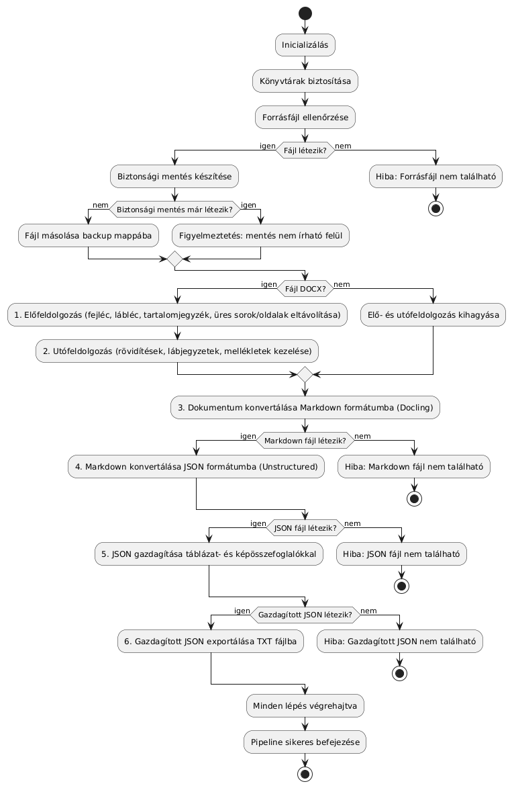

# Dokumentumfeldolgozó Python Szkript

## Cél és Alapvető Funkciók

Ez a projekt egy dokumentumfeldolgozó eszköz fejlesztésére összpontosít, amely PDF és DOCX fájlokat dolgoz fel, majd azokat strukturált, könnyen használható kimeneti formátumokba alakítja, mint például Markdown és JSON. A cél a dokumentumok tartalmának egyszerűsített áttekintése, összefoglalása és strukturálása, beleértve táblázatok és képek automatikus feldolgozását is.



### Fő Funkciók

* **Többféle formátum támogatása:** PDF és DOCX feldolgozása, a formátumspecifikus kihívások kezelése, például fejléc, lábléc és tartalomjegyzék eltávolítása.
* **Tartalom előkészítése és tisztítása:** Fejléc, lábléc, tartalomjegyzék és üres oldalak eltávolítása a dokumentum szerkezetének egyszerűsítése érdekében.
* **Konverzió Markdown és JSON formátumba:** Szöveges tartalom automatikus átalakítása könnyen feldolgozható formátumokba.
* **Tartalom gazdagítás:** Táblázatok és képek összefoglalása mesterséges intelligenciával, például GPT alapú elemzéssel.

## Részletesebb Funkciók

### Fejléc, Lábléc és Tartalomjegyzék Eltávolítása

A dokumentumok előfeldolgozása során a fejléc, lábléc és tartalomjegyzék eltávolítása kulcsfontosságú, mert:

* **Konzisztens Tartalom**: Ezek az elemek gyakran minden oldalon ismétlődnek, ami zajt okozhat a tartalom elemzése során. Eltávolításuk biztosítja, hogy csak a tényleges szöveges tartalom maradjon meg, amely a dokumentum fő üzenetét hordozza.

* **Szövegértelmezés Javítása**: Az automatikus szövegelemző algoritmusok, mint a természetes nyelvfeldolgozó (NLP) modellek, sokkal pontosabb eredményeket adnak, ha nincs zavaró ismétlődő elem a bemenetben.

* **Fájlméret és Teljesítmény**: A felesleges elemek eltávolítása csökkenti a feldolgozandó tartalom mennyiségét, gyorsabbá téve a pipeline működését és csökkentve a memóriahasználatot.

### Mellékletek Kezelése

A mellékletek kezeléséhez a save_attachments funkció biztosítja a attachments.json fájl mentését. Ezzel biztosítható, hogy a dokumentumhoz tartozó mellékletek megfelelően legyenek tárolva és strukturálva.

### Rövidítések Kezelése

A rövidítések kezelése jelentősen javítja a dokumentumok érthetőségét és használhatóságát:

* **Kontextus Megőrzése**: Sok dokumentum tartalmaz olyan rövidítéseket és szakkifejezéseket, amelyek önmagukban értelmezhetetlenek, ha nincs hozzájuk tartozó magyarázat.

* **Olvashatóság Növelése**: A rövidítések és lábjegyzetek kezelése csökkenti az olvasó kognitív terhelését, mivel nem kell folyamatosan keresnie a magyarázatokat.

* **Pontosabb Tartalomelemzés**: Az automatikus szövegelemző rendszerek könnyebben dolgoznak az ilyen tisztított, strukturált tartalommal, ami javítja a kimeneti eredmények minőségét.

### Naplózás és Hibakezelés

A naplózás biztosítja a folyamatok átláthatóságát és hibák gyors felismerését. A naplózás JSON formátumban rögzíti a naplóbejegyzéseket, és támogatja a napi naplórotációt. Az érzékeny adatok, például API kulcsok, automatikusan maszkolásra kerülnek a naplókban.

## Működési Lépések

1. **Bemeneti Fájlok Kezelése:** A bemeneti PDF vagy DOCX fájlok beolvasása, formátumuk validálása és szükség esetén biztonsági mentés készítése.
2. **Előfeldolgozás:** Fejléc, lábléc, tartalomjegyzék és üres oldalak eltávolítása a dokumentum szerkezetének javítása érdekében.
3. **Tartalom Konverzió:** Dokumentum konvertálása Markdown formátumba a könnyebb szöveges feldolgozás érdekében.
4. **Strukturálás és Gazdagítás:** A dokumentum tartalmának automatikus elemzése, táblázatok és képek összefoglalása mesterséges intelligenciával.
5. **Eredmények Exportálása:** A gazdagított JSON tartalom exportálása különböző formátumokba, például TXT vagy Markdown.

## Hibakezelés és Robusztusság

* Fájlok formátumellenőrzése és automatikus hibajelzés.
* Hiányzó vagy sérült fájlok esetén részletes naplózás.

## További Fejlesztési Lehetőségek

* További formátumok támogatása (pl. ODT, RTF).
* Jobb NLP alapú elemzés, például entitásfelismerés vagy gépi tanulás alapú dokumentumstruktúra-felismerés.

## Használati Példa

A program egyszerűen futtatható a parancssorból, például:

```bash
python main.py --input input/doc1.docx --steps 7
```

Ez a parancs egy DOCX fájlt dolgoz fel, végrehajtva minden lépést és törölve az ideiglenes fájlokat a végén.

## Fájlstruktúra

A projekt a következő fő fájlokat tartalmazza:

* **main.py:** A pipeline indításáért és a parancssori argumentumok kezeléséért felelős fő fájl.
* **pipeline.py:** A dokumentumfeldolgozó folyamat lépéseit megvalósító modul.
* **processing.py:** Az egyes feldolgozási lépéseket (pl. előfeldolgozás, utófeldolgozás, konverzió) tartalmazza.
* **file\_utils.py:** A fájlkezeléshez szükséges segédfüggvények.
* **logging\_config.py:** A naplózás konfigurációja.
* **config.py:** A fájlok útvonalait és egyéb konfigurációs beállításokat tartalmazza.
* **api\_utils.py:** OpenAI API hívások kezelésére szolgáló modul.
* **pre\_post\_processing.py:** A dokumentum elő- és utófeldolgozását végző modul.
* **prompts.py:** Előre definiált promptok és utasítások a szöveges feldolgozáshoz.
* **validation.py:** Markdown formázás validálása.

## Függőségek

A projekt a következő alapvető könyvtárakra és modulokra támaszkodik:

* **docling:** Szöveges tartalom feldolgozás, beleértve a természetes nyelvfeldolgozást és dokumentumstruktúra-elemzést.
* **unstructured:** Markdown és JSON konverzió, valamint dokumentumok strukturálatlan tartalmának elemzése.
* **openai:** Mesterséges intelligencia alapú tartalomgazdagítás GPT modellekkel.
* **python-docx:** DOCX fájlok feldolgozása, beleértve a bekezdések, táblázatok és képek kezelését.
* **pypdf:** PDF fájlok beolvasása és feldolgozása, oldalak, szövegek és metaadatok kinyerése.
* **pandas:** Táblázatos adatok kezelése és elemzése, amely hasznos a strukturált dokumentumok feldolgozásánál.
* **numpy:** Matematikai műveletek és mátrixműveletek, amelyek a dokumentumfeldolgozó algoritmusokban hasznosak.
* **nltk:** Természetes nyelvfeldolgozási eszközkészlet, beleértve a tokenizálást és nyelvi modelleket.
* **beautifulsoup4:** HTML és XML dokumentumok elemzése, amely szükséges lehet bizonyos beágyazott tartalmak feldolgozásához.
* **tqdm:** Haladásjelző sávok a hosszabb feldolgozási műveletek során.
* **openpyxl:** Excel fájlok olvasása és írása.
* **typing:** Típusjelölések és annotációk a kód olvashatóságának és stabilitásának javítása érdekében.
* **requests:** HTTP kérések küldése és kezelése, például API-k meghívásához.
* **regex:** Fejlett reguláris kifejezések a szövegek precíz elemzéséhez.
* **structlog:** Strukturált naplózás támogatása, amely részletes hibakövetést biztosít.
* **jsonschema:** JSON fájlok séma alapú validálása a strukturált adatok kezeléséhez.

## Korlátok és Jövőbeli Fejlesztések

* Jelenleg csak PDF és DOCX formátumokat támogat.
* Internetkapcsolat szükséges az OpenAI API használatához.
* További fájltípusok és nyelvi támogatás a következő fejlesztési fázisban.

## Eredmények (táblázatfeldolgozás)

### Promptok


```python
TABLE_SYSTEM_MESSAGE = """
Ön egy intelligens dokumentumelemző asszisztens, amely PDF-dokumentumokból strukturálatlan szöveget és táblázatos adatokat dolgoz fel, pontos és világos összefoglalókat készítve.

A válaszok legyenek:  
- **Pontosak és tárgyszerűek:** Minden adatot hiánytalanul és pontosan adjon vissza, beleértve a dátumokat, számokat és szöveges megjegyzéseket. Ne hagyjon figyelmen kívül semmilyen részletet, és kerülje az adatok átalakítását vagy értelmezését.  
- **Folyamatos szöveg:** Kerülje a táblázatos formátumot, felsorolásokat és más strukturált elemeket; a válaszok mindig összefüggő, folyamatos szövegek legyenek, amelyek természetes, összefüggő mondatokból állnak.  
- **Következtetések nélkül:** Ne tartalmazzanak statisztikai elemzéseket, általános értékeléseket vagy interpretációkat, és ne egészítse ki a tartalmat saját megállapításokkal. Minden adatot a forrásból közvetlenül vegyen át, anélkül, hogy bármilyen további értelmezést hozzáadna.  
- **Forrássemlegesek:** Ne utaljon a forrásdokumentum formátumára, szerkezetére vagy típusára, és ne használjon olyan kifejezéseket, mint "a táblázat szerint" vagy "az adatok alapján".  
- **Egységes formázás:** Minden dátumot, időpontot és határozatot pontosan úgy adjon vissza, ahogyan a forrásban szerepel, beleértve a zárójeles megjegyzéseket is, anélkül, hogy megváltoztatná a formátumukat vagy jelentésüket.  

Minden összefoglaló legyen közvetlen és egyértelmű, pontosan tükrözve a forrásadatokat, kerülve a kiegészítéseket és általánosításokat.
"""
```

```python
TABLE_SUMMARY_PROMPT = """
Elemezze a következő táblázat adatait, és készítsen róla egy világos, tömör összefoglaló bekezdést magyar nyelven.  

Elvárások:  
- **Pontos és teljes adatvisszaadás:** Minden információt pontosan és hiánytalanul rögzítsen, beleértve a dátumokat, számokat és szöveges megjegyzéseket. Kerülje az adatok módosítását vagy kihagyását.  
- **Következtetések nélkül:** Ne vonjon le általánosításokat, ne egészítse ki a tartalmat saját megállapításokkal, és ne készítsen statisztikai elemzéseket.  
- **Folyamatos szöveg:** Kerülje a táblázatos formázást, felsorolásokat és egyéb strukturált elemeket. A válasz legyen összefüggő, természetes szöveg, amely pontosan tükrözi a forrásadatokat.  
- **Forrássemleges megfogalmazás:** Ne utaljon a táblázat formátumára vagy a dokumentum szerkezetére.  
- **Egységes formázás:** Minden dátumot és időpontot pontosan úgy adjon vissza, ahogy a forrásban szerepel, beleértve a zárójeles kiegészítéseket is.  

Táblázat adatai:  
{table_data}
"""
```

### Példák a HKR dokumentumból

#### b7acf3e56edf87468cf44d2df78595f5

**Táblázat**:

| Kérelem/beadvány típusok | Benyújtási határidő/ időszak | Mellékelt dokumentumok | Mód | Egri képzési helyen | Egri képzési helyen |  |  | Jászberényi Campus | Jászberényi Campus |  |  |
| --- | --- | --- | --- | --- | --- | --- | --- | --- | --- | --- | --- |
| Kérelem/beadvány típusok | Benyújtási határidő/ időszak | Mellékelt dokumentumok | Mód | Benyújtás helye | Döntéshozó/hitelesítő |  |  | Benyújtás helye | Döntéshozó/hitelesítő |  |  |
| Adatváltozás bejelentése | folyamatos | adatváltozást igazoló dokumentum másolata | E | TO | - |  |  | JC-OCS | - |  |  |
| Aktív félév passzívvá nyilvánítása | október 14. / március 14. |  | E | TO | TO vezető |  |  | JC-OCS | JC-OCS vezető |  |  |
| Átvétel más intézményből | a hallgatói jogviszony létesítését megelőző félév, tavaszi félév esetén január 20., őszi félév esetén augusztus 20 | hallgatói jogviszony igazolás, hitelesített tantárgyi tematikák, hitelesített leckekönyv másolat/kivonat vagy hitelesített törzslap kivonat | P | dékáni hivatal | kari TKB elnök (kiadmány hiteléül kari TKB ügyrendjében meghatározott személy) |  |  | JC-OCS | kari TKB elnök (kiadmány hiteléül kari TKB ügyrendjében meghatározott személy) |  |  |
| Bizottsági vizsga (ötödik javítóvizsga) | vizsgát megelőző 5 munkanapig | - | E | tanszék | tanszékvezető |  |  | tanszék | tanszékvezető |  |  |
| Előzetes kreditelismerési kérelem |  | leckekönyv másolat, oklevél másolat, oklevélmelléklet másolat | P | FKO | KÁB elnök (kiadmány hiteléül KÁB titkár) |  |  | JC-OCS | KÁB elnök (kiadmány hiteléül KÁB titkár) |  |  |
| Esélyegyenlőségi kérelmek | folyamatos | a kérelemben foglaltakat alátámasztó dokumentumok | P | HTSZK | EB elnök |  |  | JC-OCS | EB elnök |  |  |
| Hallgatói jogviszony megszüntetése | folyamatos | - | E | TO | rektor (a kiadmány hiteléül az oktatási főigazgató) |  |  | JC-OCS | rektor (a kiadmány hiteléül az oktatási főigazgató) |  |  |
| Hallgatói jogviszony szünetelése betegség, baleset, vagy egyéb más váratlan ok miatt | folyamatos | kérelmet alátámasztó dokumentumok | E | dékáni hivatal | kari TKB elnök (kiadmány hiteléül kari TKB ügyrendjében meghatározott személy) |  |  | JC-OCS | kari TKB elnök (kiadmány hiteléül kari TKB ügyrendjében meghatározott személy) |  |  |
| Határidőn túli beiratkozás/bejelentkezés | legkésőbb a beiratkozási/ bejelentkezési határidő napját követő 10. napig | - | E | TO | Dékán (a kiadmány hiteléül dékáni hivatalvezető) |  |  | JC-OCS | Dékán (a kiadmány hiteléül dékáni hivatalvezető) |  |  |
| Jogorvoslati kérelmek | folyamatos | a jogorvoslati kérelemben foglaltakat alátámasztó dokumentumok | P | TO | HAJOB (kiadmányi hiteléül HAJOB titkár) |  |  | JC-OCS | HAJOB (kiadmányi hiteléül HAJOB titkár) |  |  |
| Kedvezményes tanulmányi rend | szeptember 15 / február 10. | munkáltatói v. egyéb igazolás , 4,0 súlyozott tanulmányi átlag | E | TO | kari TKB elnök (kiadmány hiteléül kari TKB ügyrendjében meghatározott személy) |  |  | JC-OCS | kari TKB elnök (kiadmány hiteléül kari TKB ügyrendjében meghatározott személy) |  |  |
| Képzésváltás (szak, tagozat, telephely) | a képzésváltást megelőző félév, tavaszi félév esetén január 20., őszi félév esetén augusztus 25 | - | E | dékáni hivatal | kari TKB elnök (kiadmány hiteléül kari TKB ügyrendjében meghatározott személy) |  |  | JC-OCS | kari TKB elnök (kiadmány hiteléül kari TKB ügyrendjében meghatározott személy) |  |  |
| Külföldi részképzésben tanulmányokat folytatók vizsgaidőszakának meghosszabbítása | a vizsgaidőszak utolsó hetének megkezdése előtt | - | E | TO | kari TKB elnök (kiadmány hiteléül kari TKB ügyrendjében meghatározott személy) |  |  | JC-OCS | kari TKB elnök (kiadmány hiteléül kari TKB ügyrendjében meghatározott személy) |  |  |
| Méltányossági kérelmek | folyamatos | a méltányossági kérelemben foglaltakat alátámasztó dokumentumok | E | OI | ORH (a kiadmány hiteléül az oktatási főigazgató) |  |  | OI | ORH (a kiadmány hiteléül az oktatási főigazgató) |  |  |
| Passzív félév aktívvá nyilvánítása | október 14 / március 14 |  | E | dékáni hivatal | Dékán (a kiadmány hiteléül dékáni hivatalvezető) |  |  | dékáni hivatal | Dékán (a kiadmány hiteléül dékáni hivatalvezető) |  |  |
| Részismereti képzésre történő felvétel | adott tanév szeptember 20. (keresztfélévben február 20.) |  | P | TO | rektor (a kiadmány hiteléül az oktatási főigazgató) |  |  | JC-OCS | rektor (a kiadmány hiteléül az oktatási főigazgató) |  |  |
| Szakirány/specializáció/ műveltségi területi modul (továbbiakban modul) változtatása, további modulok felvétele | a modul választás félévében a vizsgaidőszak utolsó munkanapja | - | E | dékáni hivatal | Dékán (a kiadmány hiteléül dékáni hivatalvezető) |  |  | dékáni hivatal | Dékán (a kiadmány hiteléül dékáni hivatalvezető) |  |  |
| Tanegység felvételének / törlésének engedélyezése határidőn túl | regisztrációs időszakot követő három héten belül | - | E | TO | Dékán (végrehajtás dékáni hivatalvezető) |  |  | JC-OCS | Dékán (végrehajtás dékáni hivatalvezető) |  |  |
| Tantárgy befogadási / felmentési kérelmek | regisztrációs időszak utolsó napja | hitelesített tantárgyi tematikák, hitelesített leckekönyv másolat/kivonat vagy hitelesített törzslap kivonat | E | dékáni hivatal | KÁB elnök (kiadmányi hiteléül KÁB titkár) |  |  | JC-OCS | KÁB elnök (kiadmányi hiteléül KÁB titkár) |  |  |
| Vendéghallgatói jogviszony létesítése | vendéghallgatói jogviszony létesítést megelőző félév, őszi félév esetén augusztus 25., tavaszi félév esetén január 15 | hallgatói jogviszony igazolás, másik intézmény beleegyező nyilatkozata | P | TO | rektor (a kiadmány hiteléül az oktatási főigazgató) |  |  | JC-OCS | rektor (a kiadmány hiteléül az oktatási főigazgató) |  |  |
| Szakdolgozat/diplomamunka határidőn túli leadása, feltöltése | szakdolgozat/diplomamunka leadási/feltöltési határidőt követő 1 hét |  | E | dékáni hivatal | Dékán (a kiadmány hiteléül a dékáni hivatalvezető) |  |  | dékáni hivatal | Dékán (a kiadmány hiteléül a dékáni hivatalvezető) |  |  |
| Kötelező foglalkozásokon való távolmaradás engedélyezése | foglalkozás előtt | igazolások | E | dékáni hivatal | Dékán (a kiadmány hiteléül a dékáni hivatalvezető) |  |  | dékáni hivatal | Dékán (a kiadmány hiteléül a dékáni hivatalvezető) |  |  |
| Szakdolgozati/ diplomamunka témakör / konzulens választására | alap- és mesterképzésben, illetve az osztatlan képzésben a szakdolgozat témáját a záróvizsgát megelőzően legalább egy évvel, minden év június 1-ig, illetve december 15-ig, Kkt féléves képzés esetén az első félév szorgalmi időszak 8 hetének utolsó munkanapjáig | alap- és mesterképzésben, illetve az osztatlan képzésben a szakdolgozat témáját a záróvizsgát megelőzően legalább egy évvel, minden év június 1-ig, illetve december 15-ig, Kkt féléves képzés esetén az első félév szorgalmi időszak 8 hetének utolsó munkanapjáig | E | TO | konzulens és szakfelelős, |  |  | JC-OCS | konzulens és szakfelelős, |  |  |
| Szakdolgozati/ diplomamunka témakör / konzulens választás pótlása, módosítására | nyári záróvizsga esetén a megelőző évben október 30-ig, szakirányú továbbképzésben december 15-ig, a téli záróvizsga esetén alapképzésben, szakirányú továbbképzésben – a záróvizsga évében – február 28-ig, mesterképzésben, felsőoktatási szakképzésben – a záróvizsgát megelőző év – március 31-ig | nyári záróvizsga esetén a megelőző évben október 30-ig, szakirányú továbbképzésben december 15-ig, a téli záróvizsga esetén alapképzésben, szakirányú továbbképzésben – a záróvizsga évében – február 28-ig, mesterképzésben, felsőoktatási szakképzésben – a záróvizsgát megelőző év – március 31-ig | P | szakfelelős | Dékán (a kiadmány hiteléül TO vezető) |  |  | szakfelelős | Dékán (a kiadmány hiteléül az okt.csop. vezető) |  |  |
| Szakdolgozat / diplomadolgozat / gyakorlati napló titkosítási kérelem |  |  | E | tanszék | szakfelelős |  |  | tanszék | szakfelelős |  |  |
| Utólagos záróvizsgára történő jelentkezés | a záróvizsga időszakot megelőző 15 napig | a záróvizsga időszakot megelőző 15 napig | E | dékán | dékán |  |  | dékán | dékán |  |  |
| Költségtérítés/önköltség fizetési kötelezettség teljesítéséhez támogatás szociális alapon | alapítvány ügyrendje szerint | * | P | TO | Lyceum Pro Scientiis Alapítvány |  |  | JC-OCS | Lyceum Pro Scientiis Alapítvány |  |  |
| Visszautalásához / rendelkezés visszavonásához kérelem | hallgatói jogviszony szüneteltetésének vagy megszűnésének esetén legkésőbb a tantárgyfelvétel véglegesítésének időpontjáig | - | E | TO | gazdasági főigazgató |  |  | JC-OCS | gazdasági főigazgató |  |  |
| Költségtérítés/önköltség/térítési díj befizetésének elhalasztására kérelem | folyamatos | - | E | TO | oktatási főigazgató gazdasági főigazgatói egyetértéssel (a kiadmány hiteléül TO vezető) |  |  | JC-OCS | oktatási főigazgató gazdasági főigazgatóiegyetértéssel (a kiadmány hiteléül az okt.csop. vezető) |  |  |
| Átsorolási kérelem államilag támogatott/ magyar állami ösztöndíjas formára | pályázati kiírásban megadott időpontig |  | E | TO | ESZÖB |  |  | JC-OCS | ESZÖB |  |  |
| Kollégiumi/diákotthoni pályázat | pályázati kiírásban megadott időpontig | * | E | TO/kollégiumi koordinátor | ESZÖB |  |  | JC-OCS/kollégiumi koordinátor | ESZÖB |  |  |
| Alaptámogatás | beiratkozáskor | * | E | ESZÖB | ESZÖB |  |  | JC-OCS | ESZÖB |  |  |
| Állami félévek meghosszabbítása (fogyatékosság miatt) | folyamatos | fogyatékosság igazolása | P | TO | Oktatási rektorhelyettes/EB elnök javaslata |  |  | JC-OCS | Oktatási rektorhelyettes/EB elnök javaslata |  |  |
| Rendszeres szociális támogatás | félévenként a regisztrációs időszakot utolsó napját követő második hét utolsó munkanapjáig | * | E | ESZÖB | ESZÖB |  |  | JC-OCS | ESZÖB |  |  |
| Rendkívüli szociális támogatás | folyamatos | szociális helyzete váratlan romlását igazoló dokumentum(ok) | E | ESZÖB | ESZÖB |  |  | JC-OCS | ESZÖB |  |  |
|  |  |  |  |  |  |  |  |  |  |  |  |
| Nemzeti felsőoktatási ösztöndíj | pályázati kiírásban megadott időpontig | pályázati kiírás szerint | P | HTSZK | Szentátus/ felsőoktatásért felelős miniszter |  |  | JC-OCS | Szentátus/ felsőoktatásért felelős miniszter |  |  |
|  |  |  |  |  |  |  |  |  |  |  |  |
| Külföldi hallgatók miniszteri ösztöndíja | pályázati kiírásban megadott időpontig | pályázati kiírás szerint | P | TO | HÜB javaslatra felsőoktatásért felelős miniszter |  |  | JC-OCS | HÜB javaslatra felsőoktatásért felelős miniszter |  |  |
| Intézményi szakmai, tudományos és közéleti ösztöndíjak | pályázati kiírásban megadott időpontig | pályázati kiírás szerint | E/P | pályázati kiírás szerint | pályázati kiírás szerint |  |  | pályázati kiírás szerint | pályázati kiírás szerint |  |  |
| Szent Imre ösztöndíj | szeptember 20. | szükséges dokumentumok, igazolások | E | HTSZK | ESZÖB |  |  | HTSZK | ESZÖB |  |  |
| Alumni ösztöndíj | szeptember 20. | szükséges dokumentumok, igazolások | E | HTSZK | HÜB |  |  | HTSZK | HÜB |  |  |
| Arany János ösztöndíj | pályázati kiírásban megadott időpontig | igazolások | E | HTSZK | ESZÖB |  |  | HTSZK | ESZÖB |  |  |
| Eszterházy ösztöndíj | szeptember 20. | pályázati kiírás szerint | E | HTSZK | ESZÖB |  |  | HTSZK | ESZÖB |  |  |
| Gárdonyi ösztöndíj | szeptember 20. | pályázati kiírás szerint | E | HTSZK | ESZÖB |  |  | HTSZK | ESZÖB |  |  |
| IUNO ösztöndíj | szeptember 20. | pályázati kiírás szerint | E | HTSZK | ESZÖB |  |  | HTSZK | ESZÖB |  |  |
| Hallgatók a fogyatékossággal élő hallgatókért ösztöndíj | pályázati kiírásban megadott időpontig | pályázati kiírás szerint | E | HTSZK | ESZÖB |  |  | HTSZK | ESZÖB |  |  |
| Fogyatékkal élő hallgatók kiegészítő normatív támogatása | szeptember 30. / február 28. |  | P | EB | EB elnök javaslatára ORH |  |  | EB | EB elnök javaslatára ORH |  |  |
| Pyrker ösztöndíj | pályázati kiírásban megadott időpontig | pályázati kiírás szerint | E | HTSZK | ESZÖB |  |  | HTSZK | ESZÖB |  |  |
| Informatikus Mesterképzési ösztöndíj | pályázati kiírásban megadott időpontig | pályázati kiírás szerint | E | HTSZK | Bizottság |  |  |  |  |  |  |
| Esélyt a tanuláshoz ösztöndíj | pályázati kiírásban megadott időpontig | pályázati kiírás szerint | E | HTSZK | ESZÖB |  |  | HTSZK | ESZÖB |  |  |
| Magyar állampolgár által, államilag elismert külföldi felsőoktatási intézményben folytatott képzéshez segítséget nyújtó ösztöndíj pályázat | pályázati kiírásban megadott időpontig | pályázati kiírás szerint | P | TO | HÜB javaslatra felsőoktatásért felelős miniszter |  |  | JC-OCS | HÜB javaslatra felsőoktatásért felelős miniszter |  |  |
| Európai gazdasági térség országaiban résztanulmányokat folytató hallgatók ösztöndíja | pályázati kiírásban megadott időpontig | pályázati kiírás szerint | P | NHSZI | NHSZI(illetékes tanszékvezető, illetve intézetigazgató és a HÖK külügyi referensének véleményével) |  |  | NHSZI | NHSZI (illetékes tanszékvezető, illetve intézetigazgató és a HÖK külügyi referensének véleményével) |  |  |

> **Összefoglaló**: A kérelem és beadvány típusok benyújtási határidőit, a szükséges mellékelt dokumentumokat, valamint a benyújtás helyét és a döntéshozókat tartalmazó adatok széles spektrumot ölelnek fel. Az adatváltozás bejelentése folyamatos, és szükséges melléklete az adatváltozást igazoló dokumentum másolata. Az aktív félév passzívvá nyilvánítása október 14-én és március 14-én esedékes, ez esetben a szükséges dokumentumok nem meghatározottak. Az átvétel más intézményből a hallgatói jogviszony létesítését megelőző félévben esedékes, és több igazolást is megkövetel. Bizottsági vizsga esetén a bejegyzést a vizsgát megelőző 5 munkanapon belül kell benyújtani. A jogorvoslati kérelmek folyamatosak, és szükséges a kérelemben foglaltakat alátámasztó dokumentumok benyújtása. A hallgatói jogviszony megszüntetésére, valamint a szüneteltetésre és az egyéb kérelmekre szintén folyamatos határidő vonatkozik. Számos kérelem, köztük a költségtérítési és szociális támogatások, a képzési helytől függően eltérő, de rendszerint folyamatos vagy meghatározott időszakon belül benyújtandók. Az ösztöndíjak, mint például a Szent Imre vagy Eszterházy ösztöndíj, legkésőbb szeptember 20-ig pályázhatók, és számos kérelem a pályázati kiírásokban megadott időpontokhoz kötött.

##### Értékelés (b7acf3e56edf87468cf44d2df78595f5)

###### **Egyértelműség**

A táblázat jól strukturált, tagolt, a sorok és oszlopok tisztán bemutatják az információkat. A fejléc egyértelmű, azonban néhány mező üresen maradt, ami zavarhatja az olvasókat. A szöveg szintén világos és informatív, de néhány részlet, mint például az „aktív félév passzívvá nyilvánítása” nyújtja a határidőt, ám nem tartalmaz pontos információt a szükséges mellékletekről, ami homályossá teszi a tájékoztatást.

###### **Pontosság**

Az összefoglalóban található információk javarészt pontosak, azonban előfordul, hogy a táblázatban szereplő specifikus kellékekre (mellékletek) nincs utalás, ami azt jelenti, hogy a tájékoztatás hiányos lehet. A „hallgatói jogviszony megszüntetése” és hasonló témájú bejegyzések ismételten hangsúlyozniuk kellene a tárgyi előírásokat.

###### **Teljesség**

A szöveg részletes áttekintést ad a különböző kérelmekről, de nem minden kérelemhez tartozik kiemelés az adott feltételekről. Az fontos események javarésze szerepel, de néhány kérelemnél, mint a költségtérítési támogatások, a különböző határidőkhöz és pályázati követelményekhez fűzött megjegyzések hiányoznak.

###### **Minőségi besorolás: Közepes**

A táblázat-összefoglaló pár tartalmaz önálló magyarázatokat, de a pontosság és teljesség terén hiányosságokkal küzd, ami akadályozza annak egyértelműségét és hasznosságát.

#### 0a0814cee76c23e97b1a13590065af81

**Táblázat**:

| Szervezeti egység rövid neve és megnevezése | Szervezeti egység rövid neve és megnevezése | Bizottság rövid neve és megnevezése | Bizottság rövid neve és megnevezése |
| --- | --- | --- | --- |
| ORH FKO TO JC-OCS NHSZI HÖK HTSZK | Oktatási, rektorhelyettes Felvételi és Képzésszervezési Osztály Tanulmányi és Oktatásszervezési Osztály (egri Campus) Jászberényi Campus Oktatási Csoport Nemzetközi Hallgatói Szolgáltató Iroda Hallgatói Önkormányzat Hallgatói Támogató és Szolgáltató Központ | kari TB KÁB HÜB ESZÖB HAJOB EB OI | kari Tanulmányi Bizottság Kreditátviteli Bizottság Hallgatói Ügyek Bizottsága Egyetemi Szociális Ösztöndíj Bizottság Hallgatói Jogorvoslati Bizottság Esélyegyenlőségi Bizottság Oktatási Igazgatóság |

> **Összefoglaló**: A dokumentumban szereplő adatok szerint az Oktatási, rektorhelyettes Felvételi és Képzésszervezési Osztály, a Tanulmányi és Oktatásszervezési Osztály (egri Campus), a Jászberényi Campus Oktatási Csoport, a Nemzetközi Hallgatói Szolgáltató Iroda, a Hallgatói Önkormányzat és a Hallgatói Támogató és Szolgáltató Központ tartozik az ORH FKO TO JC-OCS NHSZI HÖK HTSZK szervezeti egységekhez. Ezzel szemben a kari Tanulmányi Bizottság, a Kreditátviteli Bizottság, a Hallgatói Ügyek Bizottsága, az Egyetemi Szociális Ösztöndíj Bizottság, a Hallgatói Jogorvoslati Bizottság, az Esélyegyenlőségi Bizottság és az Oktatási Igazgatóság képezik a kari TB KÁB HÜB ESZÖB HAJOB EB OI bizottságok csoportját.

##### Értékelés (0a0814cee76c23e97b1a13590065af81)

###### Egyértelműség

A táblázat jól strukturált, és az oszlopok egyértelműen elkülönítik a szervezeti egységeket és bizottságokat. Az összefoglaló azonban kicsit terjengős, a komplex információk tartalmazása miatt időbe telik, míg az olvasó teljesen megérti a leírt kapcsolatokat. **Erősségek**: Jol olvasható a táblázat, és a sorok jól szétválasztják a különböző szervezeti elemeket.  
**Gyengeségek**: Az összefoglalóban a hosszú felsorolások miatt nehézkes az információk gyors áttekintése.

###### Pontosság

Az összefoglaló pontosan tükrözi a táblázat tartalmát, és nem tartalmaz félreértelmezéseket vagy hibákat. Mind a szervezeti egységek, mind a bizottságok nevét helyesen adta vissza, ami hozzájárul a szakmai hitelességhez.

###### Teljesség

Az összefoglaló tartalmazza az összes lényeges információt a táblázatból, tehát a teljesség szempontjából megfelel. Az összes szervezeti egység és bizottság pontosan bemutatásra kerül.

###### Összegzés

A táblázat és az összefoglaló jól összehangolt, a fő problémák a terjedelemben és az olvashatóságban rejlenek. A pontosság és a teljesség erősségei ellensúlyozzák az egyértelműségi problémákat.

**Minőségi besorolás**: **Jó**

---

#### d445f1f78b5759631c2abf70b88af6ba

**Táblázat**:

| Alapképzési szakok | Önköltség (ezer Ft/félév) | Önköltség (ezer Ft/félév) |
| --- | --- | --- |
| Alapképzési szakok | nappali | levelező/ távoktatás |
| Anglisztika | 170 | 150 |
| Biológia | 240 | 200 |
| Csecsemő- és kisgyermeknevelő | 180 | 150 |
| Elektronikus ábrázolás | 275 | - |
| Emberi erőforrások | 180 | 150 |
| Ének-zene | 280 | 275 |
| Földrajz | 230 | 190 |
| Gazdálkodási és menedzsment | 180 | 150 |
| Gazdaságinformatikus | 230 | 200 |
| Germanisztika (német) | 170 | 150 |
| Informatikus könyvtáros | 180 | 150 |
| Kémia | 250 | 210 |
| Képi ábrázolás | 275 | - |
| Kommunikáció és médiatudomány | 200 | 170 |
| Környezettan | 220 | 180 |
| Magyar | 170 | 150 |
| Matematika | 230 | 190 |
| Mozgóképkultúra és médiaismeret | 275 | 275 |
| Nemzetközi tanulmányok | 200 | 170 |
| Óvodapedagógus | 180 | 150 |
| Pedagógia | 180 | 150 |
| Plasztikai ábrázolás | 275 | - |
| Programtervező informatikus | 195 | 180 |
| Rekreációszervezés és egészségfejlesztés | 210 | 180 |
| Sportszervező | 210 | 180 |
| Szabadbölcsészet | 170 | 150 |
| Szociális munka | 180 | 150 |
| Szociálpedagógia | 200 | 170 |
| Szőlész-borász mérnöki | 210 | 180 |
| Tanító | 180 | 150 |
| Testnevelő-edző | 210 | 180 |
| Történelem | 170 | 150 |
| Turizmus-vendéglátás | 180 | 150 |

> **Összefoglaló**: Az alapképzési szakok önköltségi díjai félévenként változóak, a nappali és levelező/távoktatás formájában. Az Anglisztika nappali önköltsége 170 ezer Ft, míg levelező formában 150 ezer Ft. A Biológia nappali önköltsége 240 ezer Ft, levelezőként 200 ezer Ft. A Csecsemő- és kisgyermeknevelő nappali önköltsége 180 ezer Ft, levelező formájában 150 ezer Ft. Az Elektronikus ábrázolás nappali önköltsége 275 ezer Ft, levelező formája nincs. Az Emberi erőforrások nappali önköltsége 180 ezer Ft, levelezőként 150 ezer Ft. Az Ének-zene nappali önköltsége 280 ezer Ft, levelező formájában 275 ezer Ft. A Földrajz nappali önköltsége 230 ezer Ft, levelezőként 190 ezer Ft. A Gazdálkodási és menedzsment nappali önköltsége 180 ezer Ft, levelezőként 150 ezer Ft. A Gazdaságinformatikus nappali önköltsége 230 ezer Ft, levelezőként 200 ezer Ft. A Germanisztika nappali önköltsége 170 ezer Ft, levelezőként 150 ezer Ft. Az Informatikus könyvtáros nappali önköltsége 180 ezer Ft, levelezőként 150 ezer Ft. A Kémia nappali önköltsége 250 ezer Ft, levelezőként 210 ezer Ft. A Képi ábrázolás nappali önköltsége 275 ezer Ft, levelező formája nincs. A Kommunikáció és médiatudomány nappali önköltsége 200 ezer Ft, levelezőként 170 ezer Ft. A Környezettan nappali önköltsége 220 ezer Ft, levelezőként 180 ezer Ft. A Magyar nappali önköltsége 170 ezer Ft, levelezőként 150 ezer Ft. A Matematika nappali önköltsége 230 ezer Ft, levelezőként 190 ezer Ft. A Mozgóképkultúra és médiaismeret nappali önköltsége 275 ezer Ft, levelező formájában 275 ezer Ft. A Nemzetközi tanulmányok nappali önköltsége 200 ezer Ft, levelezőként 170 ezer Ft. Az Óvodapedagógus nappali önköltsége 180 ezer Ft, levelezőként 150 ezer Ft. A Pedagógia nappali önköltsége 180 ezer Ft, levelezőként 150 ezer Ft. A Plasztikai ábrázolás nappali önköltsége 275 ezer Ft, levelező formája nincs. A Programtervező informatikus nappali önköltsége 195 ezer Ft, levelezőként 180 ezer Ft. A Rekreációszervezés és egészségfejlesztés nappali önköltsége 210 ezer Ft, levelezőként 180 ezer Ft. A Sportszervező nappali önköltsége 210 ezer Ft, levelezőként 180 ezer Ft. A Szabadbölcsészet nappali önköltsége 170 ezer Ft, levelezőként 150 ezer Ft. A Szociális munka nappali önköltsége 180 ezer Ft, levelezőként 150 ezer Ft. A Szociálpedagógia nappali önköltsége 200 ezer Ft, levelezőként 170 ezer Ft. A Szőlész-borász mérnöki nappali önköltsége 210 ezer Ft, levelezőként 180 ezer Ft. A Tanító nappali önköltsége 180 ezer Ft, levelezőként 150 ezer Ft. A Testnevelő-edző nappali önköltsége 210 ezer Ft, levelezőként 180 ezer Ft. A Történelem nappali önköltsége 170 ezer Ft, levelezőként 150 ezer Ft. A Turizmus-vendéglátás nappali önköltsége 180 ezer Ft, levelezőként 150 ezer Ft.

##### Értékelés (d445f1f78b5759631c2abf70b88af6ba)

###### Egyértelműség

A táblázat jól struktúrált, hatékonyan szétválasztja az alapképzési szakokat a nappali és levelező/távoktatás formátum szerint. Az összefoglaló is logikusan építkezik, lépésről lépésre bemutatva a fontosabb szakokat és költségeiket. Azonban a táblázatban található "Önköltség (ezer Ft/félév)" oszlopcímek ismétlődnek, ami zavaró lehet.

###### Pontosság

Az összefoglaló akkurátus módon tükrözi a táblázat tartalmát, a megadott költségek pontosan szerepelnek, és nincs hibás információ a szakok költségeivel kapcsolatban. Mindazonáltal a "levező" (levélő) formára vonatkozó megjegyzés hiánya egy kisebb hiányosság, hiszen jelen esetben az Elektronikus ábrázolás, Képi ábrázolás és a Plasztikai ábrázolás szakoknál nem szerepel adat.

###### Teljesség

Bár az összefoglaló széleskörű információt ad az alapképzési szakok önköltségéről, az említett hiányosságok miatt nem teljesen átfogó. A levélmozgásos szakok hiányos adataim miatt nem közlik a teljes információt a költségekről. A fontosabb szakok említése viszont indokolt és hasznos.

###### Összegzés

Az alábbi táblázat-összefoglaló pár **Jó** minősítést kap, mivel jól szerkesztett és pontos, de a teljesség terén jelentkeznek hiányosságok, amelyek javítandók.

#### Összegzés és tanulságok

Az értékelések összesítése alapján a táblázatok és összefoglalók általános minősége vegyes képet mutat: az értékelések közül egy Kiváló, két Jó és egy Közepes minősítést kaptak. Az általános tendencia azt mutatja, hogy a táblázatok struktúrája és logikai felépítése erős, azonban a részletgazdagság és a teljesség terén tapasztalhatóak hiányosságok.

A közös erősségek közé tartozik a táblázatok és összefoglalók egyértelműsége és pontossága. Az információk jól válnak el egymástól, a fejlécek világosak, és a legtöbb értékelés pontosan tükrözi a táblázatokban található adatokat. Azonban a gyakori gyengeségek között említést nyer az olvashatóság nehézsége, főleg a hosszú felsorolások és a részletezés hiánya miatt, ami megnehezíti az információk gyors áttekintését.

A javasolt javítások érdekében érdemes lenne fokozni az összefoglalók részletességét, például a hiányzó információk kiemelésével, és biztosítani, hogy a táblázatok ne tartalmazzanak zavaró ismétléseket. Emellett a szövegek egyszerűsítése és tömörítése segíthet az olvashatóság javításában.

Összességében a trendek arra utalnak, hogy a táblázatok tartalmának tisztasága és pontossága az erősségek, míg az információk teljes megjelenítése, valamint az olvashatóság növelése terén fontos a fejlődés. A jövőbeni munkáknál hasznos lehet a szorosabb együttműködés a számadatokkal és szöveges információkkal kapcsolatban, hogy minden releváns részlet világosan és érthetően jelenjen meg.
